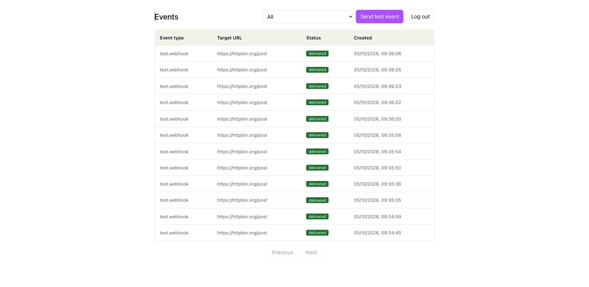
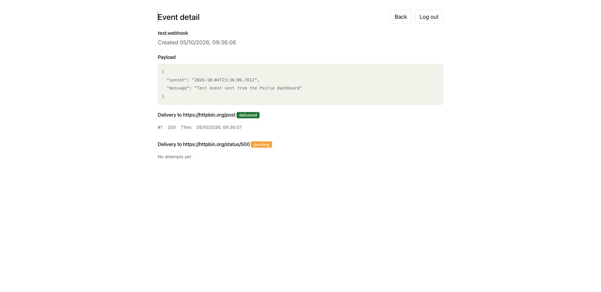

# Postie

A webhook delivery service — the piece of infrastructure that sits between "something happened in your app" and "the other systems that need to know about it," so the caller doesn't have to trust that every receiving server is online, fast, and reliable.

**Live:** [postie-frontend-production-bbb3.up.railway.app](https://postie-frontend-production-bbb3.up.railway.app) (dashboard) · [postie-webhook-production.up.railway.app](https://postie-webhook-production.up.railway.app) (API)

**[▶ Watch the demo video](https://youtu.be/NSb37vj27fg)** — ~4 minutes, shows a real delivery, a real failure retrying, the circuit breaker pausing, and the code behind it.

> Full write-up of the design, and the trade-offs behind it, in [`docs/ARCHITECTURE.md`](./docs/ARCHITECTURE.md) and [`docs/QUEUE_DECISION.md`](./docs/QUEUE_DECISION.md). Deploy steps in [`DEPLOY.md`](./DEPLOY.md).

## What it does

```txt
Client App
   |
   | POST /api/events  ("order.created")
   v
Postie API ---------- saves event -----------> PostgreSQL
   |                                                |
   | fans out to every matching Endpoint            | endpoint registered?
   v                                                 v
RabbitMQ  <----------------------------------  Delivery row created
   |
   | one job per Delivery
   v
Delivery Worker ----> signs request (HMAC) ----> Customer Endpoint
   |                                                |
   | success                                failure |
   v                                                 v
status: delivered                    Retry Poller (backoff ladder)
                                                     |
                                      still failing after 6 attempts
                                                     v
                                          status: failed_permanent (DLQ)

Meanwhile: Circuit Breaker watches each Endpoint's failure rate and
pauses delivery to it if it's clearly down, independent of any single
Delivery's own retry schedule.

Dashboard (React) <---- GET /api/dashboard/events ---- same PostgreSQL data,
reads via a logged-in user session (JWT), not the API key.
```

- **Event ingestion API** — `POST /api/events` validates the request, persists it, and fans it out to every `Endpoint` registered for that `Application` (matching on `filterTypes`), creating one `Delivery` row per match. If fan-out/publish fails, the event is marked `queue_failed` instead of silently disappearing (the DB write already succeeded by that point). Rate-limited (100/min per IP) since this is a public, unauthenticated-at-the-network-level endpoint.
- **Cursor-based pagination** on `GET /api/events` and the dashboard's event list — built on Prisma's cursor pagination rather than offset, so results stay correct even as new events are inserted concurrently.
- **A delivery worker** (`src/workers/deliveryWorker.js`) that consumes one queued job per `Delivery`, POSTs the event to the endpoint's real URL with an HMAC-SHA256 signature (`X-Postie-Signature`), and records every attempt as a `DeliveryAttempt`.
- **Retry with exponential backoff** — on failure the worker schedules the next attempt using the ladder in `docs/ARCHITECTURE.md` §5 (30s → 2m → 10m → 1h → 6h → 24h); a separate **retry poller** (`src/workers/retryPoller.js`) wakes up deliveries once their `nextAttemptAt` has passed. After 6 attempts a delivery is marked `failed_permanent` instead of retrying forever (the DLQ concept from §7, at the application level rather than a RabbitMQ dead-letter exchange).
- **Circuit breaker** (`docs/ARCHITECTURE.md` §8) — if an endpoint fails 5 times within a 60-second window, Postie pauses *all* delivery to it for 5 minutes, then sends exactly one probe call to decide whether to reopen. This is a different problem than retry/backoff: backoff paces one delivery's own retries, the breaker decides whether *any* call to a clearly-broken endpoint should go out at all. Window is anchored to the first failure in the streak, not the previous one — a steady trickle of occasional failures correctly never trips it.
- **Recovery scan** (`src/workers/recoveryScan.js`) — implements the design in `docs/ARCHITECTURE.md` §16: periodically re-fans-out events stuck at `queue_failed` or `received` for too long, capped at 3 attempts per event.
- **API key auth** for machine callers (`/api/events`, `/api/endpoints`, `/api/applications`) — every request needs `Authorization: Bearer <key>`, checked against a hash (raw keys are never stored). Requests are scoped per-organization: an `appId`/`Endpoint` id belonging to a different org 404s the same way a nonexistent one would, so a key can't be used to probe what other orgs have.
- **Human login + dashboard** — signup/login issues a JWT (`userAuth`), kept deliberately separate from the API key: a leaked browser session only affects one user and expires; it never touches the shared API key real integrations depend on.
- **React dashboard** (`frontend/`) — event list with a status filter (doubles as the dead-letter-queue view, filtered to `failed_permanent`) and pagination, an event detail page with the full delivery-attempt timeline, and a **"Send test event" button** — the same self-service test-webhook pattern Stripe and Twilio use, so anyone can verify their integration without external tooling.
- **Endpoint management API** (`POST/GET/PATCH /api/endpoints`) — customers register and update their own endpoints instead of a dev seeding them by hand. No hard delete: `Endpoint` cascades to `Delivery`, so removing one would erase delivery history — disabling (`PATCH { disabled: true }`) keeps the record.
- **A Postgres schema modeling the full multi-tenant shape** the system is designed to grow into — organizations, applications, endpoints, events, deliveries, delivery attempts, plans/subscriptions for billing — even where the application code doesn't fully exercise every table yet (see Roadmap below).

## Demo video

[Watch on YouTube](https://youtu.be/NSb37vj27fg)

A ~4-minute walkthrough: an event delivered successfully, a failed delivery
retrying with backoff, the circuit breaker pausing a dead endpoint (with the
actual code behind it), and a real delivery that exhausted every retry and
landed in the dead-letter view.

## Screenshots

| Event list (status filter + pagination) | Event detail (fan-out to 2 endpoints, one delivered, one retrying) |
|---|---|
|  |  |

## Why these choices

- **RabbitMQ over Kafka** — Postie is a task queue problem (attempt a delivery, retry on failure, eventually give up), not a stream-processing problem. No replay requirement, no need for Kafka's operational overhead at this scale. Full reasoning in [`docs/QUEUE_DECISION.md`](./docs/QUEUE_DECISION.md).
- **PostgreSQL over a document store** — the data has real relational structure (one app has many endpoints, one event can fan out to many deliveries) that benefits from foreign keys and transactions rather than fighting against them.
- **React for the dashboard** — the UI is naturally a set of independent pieces (event list, event detail, status badge) that each manage their own slice of the screen; also the most in-demand frontend framework for the junior roles this project targets. Plain `useState`/props, no Context or external store — the dashboard is 4 screens deep at most, state only ever needs to pass down one level, so there's no prop-drilling problem to solve. Full write-up in `docs/ARCHITECTURE.md` §17.
- **At-least-once delivery** — Postie would rather deliver a webhook twice than lose it. Consumers are expected to dedupe on `messageId`.
- **A modular monolith, not microservices** — this is a project built and operated by one person; premature service boundaries would add coordination overhead with no corresponding benefit yet.

## Design decisions, each with the "why"

| Decision | Why |
|---|---|
| **Retry with exponential backoff** (30s→2m→10m→1h→6h→24h) | A failing endpoint is often down *temporarily* — immediate retries waste effort and can worsen an outage; retrying forever at a fixed interval does too. Backing off gives the endpoint time to recover without the caller giving up. |
| **Circuit breaker, separate from backoff** | Backoff paces *one delivery's* retries. It doesn't stop 50 different deliveries from each independently hammering the same dead endpoint on their own schedules. The breaker tracks the endpoint itself and pauses everything to it at once — protecting worker capacity and not making a real outage worse. |
| **HMAC-SHA256 request signing** | Lets the receiving server verify a webhook genuinely came from Postie (and wasn't tampered with in transit) using a shared secret, without needing mutual TLS or an allowlist of source IPs. |
| **DLQ at the application level, not a RabbitMQ dead-letter exchange** | After 6 attempts a delivery is marked `failed_permanent` in Postgres rather than routed to a broker-level DLQ — keeps the "why did this fail" history (every attempt, status code, response body) queryable in the same place as the rest of the data, visible on the dashboard instead of needing separate queue tooling to inspect. |

## Stack

Node.js · Express · PostgreSQL + Prisma · RabbitMQ (amqplib) · React + Vite · axios · express-validator · Jest

## Running locally

```bash
docker compose up -d        # Postgres + RabbitMQ
npx prisma migrate deploy   # apply schema
node prisma/seed.js         # seed a test org/application/endpoint/api key (prints the key once)

npm run dev                        # API on :3000
npm run start:worker               # delivery worker, separate terminal
npm run start:retry-poller         # retry poller, separate terminal
npm run start:recovery-scan        # recovery scan, separate terminal
```

Or bring up the whole stack (API + all 3 workers + Postgres + RabbitMQ, migrated automatically) in one command: `docker compose up -d --build`.

Run the test suite with `npm test` (needs `docker compose up -d` running, and a `postie_test` database migrated + seeded — see `.env.test.example`). `npm run lint` runs ESLint.

## API

### Machine callers — `Authorization: Bearer <api key>`

| Endpoint | Description |
|---|---|
| `POST /api/events` | Create an event, fan it out to matching endpoints, publish for delivery. Rate-limited: 100/min per IP |
| `GET /api/events` | List events for your org, cursor-paginated (`?cursor=`, `?limit=`) |
| `GET /api/events/:id` | Fetch a single event, `404` if it doesn't exist (or belongs to another org) |
| `POST /api/endpoints` | Register an endpoint for one of your applications |
| `GET /api/endpoints` | List your org's endpoints |
| `GET /api/endpoints/:id` | Fetch a single endpoint |
| `PATCH /api/endpoints/:id` | Update url/filterTypes/description, or disable it |
| `POST /api/applications` | Create an application |
| `GET /api/applications` | List your org's applications |
| `GET /api/applications/:id` | Fetch a single application |
| `GET /health` | Liveness check (no auth) |

### Human users — `Authorization: Bearer <JWT>` (from signup/login)

| Endpoint | Description |
|---|---|
| `POST /api/auth/signup` | Create an organization + the first user (`owner`) |
| `POST /api/auth/login` | Exchange email/password for a JWT |
| `POST /api/api-keys` | Mint a new API key (`owner`/`admin` only). Full key shown once |
| `GET /api/api-keys` | List your org's API keys (name/prefix only, never the raw key) |
| `DELETE /api/api-keys/:id` | Revoke a key (`owner`/`admin` only) |
| `GET /api/dashboard/events` | List events for the dashboard, with a `?status=` filter (`pending`/`delivered`/`failed_permanent`) and pagination |
| `GET /api/dashboard/events/:id` | Full event detail: payload + every delivery's full attempt timeline |
| `POST /api/dashboard/events/test` | Send a canned test event to your first application's registered endpoints — the in-dashboard test trigger, no external tool needed |

## How this was built

Built with an AI coding agent under a deliberate review discipline — **the Three Gates**, non-negotiable on every agent-assisted change:

1. **Design gate** — a plan exists before the agent writes code.
2. **Review gate** — every changed line gets read; anything that can't be explained gets rewritten.
3. **Explain gate** — the change has to be defensible cold, no notes.

In practice: a `code-reviewer` subagent runs on every meaningful diff — it's caught a real secret-exposure bug (an HMAC signing secret being returned on every endpoint list/get, not just at creation) before it shipped. The circuit breaker's trickiest bug — two concurrent deliveries could both read "the pause just expired" and both fire a live probe call at once, instead of exactly one — came up during the review/explain gates directly rather than an automated pass, and got fixed with row-level database locking (`SELECT ... FOR UPDATE`) once I could explain back why the race existed. Full process notes, the failure log, and the sceptical take on where AI assistance helps vs. where it doesn't: [`docs/AI_WORKFLOW.md`](./docs/AI_WORKFLOW.md).

## Roadmap — designed, not yet (re)built

- **Billing (`Plan`/`Subscription`/`UsageRecord`).** Modeled in the schema, no application code uses them yet.
- **Self-serve onboarding UI.** Creating an Application, an Endpoint, or an API key is currently API-only — no dashboard form yet. A new customer has to use curl/Postman for first-time setup. "API-first, UI later" is a deliberate sequencing call, not an oversight.
